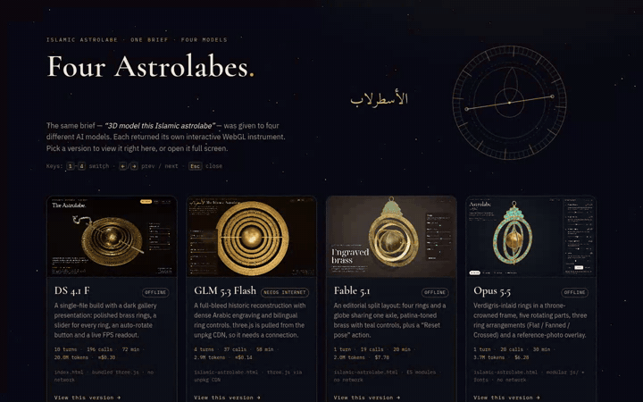

# Astrolabe Model Test

Four versions of the same "Islamic astrolabe 3D model" prompt, each generated by a
different AI model. Copied from their Open Design projects on 2026-09-26.

| Directory | Model | Entry file | 3D assets |
|---|---|---|---|
| `ds-4.1-f/` | DS 4.1 F | `index.html` | local `vendor/three.min.js` (global build) |
| `glm-5.3-flash/` | GLM 5.3 Flash | `islamic-astrolabe.html` | three.js loaded from unpkg CDN — needs internet |
| `fable-5.1/` | Fable 5.1 | `islamic-astrolabe.html` | local `vendor/` ES modules |
| `opus-5.5/` | Opus 5.5 | `islamic-astrolabe.html` | local `vendor/`, `js/`, `fonts/` |

## Why an astrolabe

The brief is a deliberate two-part test, run against one reference photo
([`astrolabe.jpg`](ds-4.1-f/astrolabe.jpg)): a brass spherical astrolabe — a celestial globe
and several nested rings riding one polar axle, hung from a throne-crowned frame.

**1. Visual capability.** The object is unforgiving for a 3D model: aged brass with
verdigris inlay, dense Arabic engraving, pierced ornament and graduations. Flat shading,
blurry lettering or "painted-on" detail show up immediately next to the photo.

**2. Mechanical logic — the hinge and the joints.** More interesting is whether the model
understood *how the parts are connected*, not just how they look:

- the frame hangs on a **hinge/shackle** at the throne and swings as one body;
- the rings and the globe are **independent rotating bodies on the same axle** — turning
  one ring must not turn the others, and must not move the frame;
- parts must not intersect or float free when turned — no ring passing through the globe,
  no ring welded to the frame that should pivot on the axle;
- the UI must map to the real joints (one control per ring, spin, reset) and reset to a
  mechanically plausible pose.

That makes the four versions comparable on both axes: does it **look** like the
photographed instrument, and does it **behave** like one — correct hinge and axis roles,
independent vs coupled motion, and no self-intersections.

## Viewing

A selector page is included at the project root (`index.html`): it shows all four versions
with real rendered thumbnails, embeds the selected one in a viewer with fullscreen and
"open in new tab" actions, and shows run statistics (turns, time, tokens, cost) plus test
notes (what each run needed, how the mechanism held up) for each model. Keyboard: `1`–`4`
to switch, `←`/`→` to cycle, `Esc` to close.

The GLM, Fable and Opus entries use ES modules, so serve the folder over HTTP instead of
opening via `file://`. From this directory:

```sh
python3 -m http.server 8000
```

Then open the selector at http://localhost:8000/ — or go directly to a version:

- http://localhost:8000/ds-4.1-f/index.html
- http://localhost:8000/glm-5.3-flash/islamic-astrolabe.html
- http://localhost:8000/fable-5.1/islamic-astrolabe.html
- http://localhost:8000/opus-5.5/islamic-astrolabe.html

The `ds-4.1-f/index.html` version also works when opened directly as a file.

## Showcase

[](assets/astrolabe-showcase.mp4)

A 44-second recording of the selector stepping left to right through the four versions —
DS 4.1 F → GLM 5.3 Flash → Fable 5.1 → Opus 5.5 — with a ring drag in each model. The
animated preview above links to the full-resolution video:

- `assets/astrolabe-showcase.mp4` — 1440×900, H.264, 25 fps, 8.4 MB
- `assets/astrolabe-showcase.gif` — 720 px preview (what's embedded above), 2.6 MB

## Notes

- `index.html` at the root is the selector page; `assets/` holds its thumbnails, fonts and
  the showcase video/GIF (not part of any model version).
- `analysis/model-run-stats.md` has the full run statistics (turns, time, tokens, cost per
  model, including a turn-by-turn breakdown).
- Each folder carries its Open Design project history in `.file-versions/` and `.od-skills/`.
  These are app-internal metadata (version snapshots, prompt texts, internal IDs) and are
  excluded from git via `.gitignore`; they stay in this folder for local reference only.
  The `*.artifact.json` export sidecars are excluded the same way.
- `astrolabe.jpg` is the shared reference photo used by all four models. It is the only
  file edited during sanitization: the bottom 112 px were cropped off to remove a personal
  detail (a fingertip), and the copies are otherwise untouched. The Opus page's image
  dimensions were updated to match.
- Screenshots/drawings made by each model are kept alongside its entry file
  (`ds-4.1-f/` has screenshots, `glm-5.3-flash/` has a drawing).

## Privacy & publishing

- No secrets, tokens, credentials, home paths, usernames or email addresses are present in
  this folder (checked with full-text scans).
- Images carry no EXIF/GPS metadata; only a generic ICC color profile remains. The showcase
  video/GIF carry no metadata either (the MP4 has only container-brand and encoder tags).
- Internal Open Design project IDs were removed from this README; the remaining IDs live
  only in the app metadata excluded by `.gitignore`.
- The repo is ready for static hosting (e.g. GitHub Pages): a `.nojekyll` file is included
  so nothing is skipped by Jekyll processing. To publish: push this folder as the repository
  root, then in **Settings → Pages** choose *Deploy from a branch* → `main` → `/ (root)`.
  All links are relative, so the site works at `https://<user>.github.io/<repo>/`.
